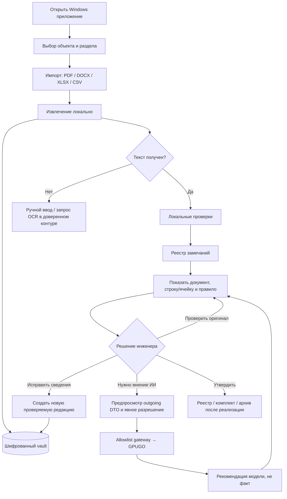
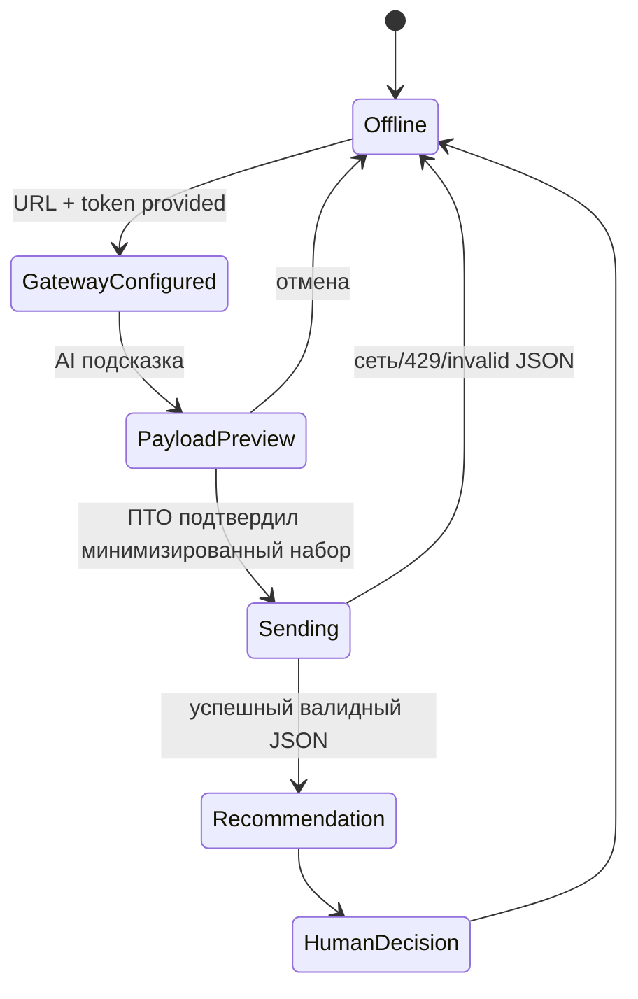

# Windows UX: действия инженера ПТО и границы

```mermaid
flowchart TD
 LOGIN["Открыть Windows приложение"] --> PROJECT["Выбор объекта и раздела"]
 PROJECT --> IMPORT["Импорт: PDF / DOCX / XLSX / CSV"]
 IMPORT --> PREP["Извлечение локально"]
 PREP --> CRYPT[("Шифрованный vault")]
 PREP --> KIND{"Текст получен?"}
 KIND -- "Нет" --> MAN["Ручной ввод / запрос OCR в доверенном контуре"]
 KIND -- "Да" --> VAL["Локальные проверки"]
 VAL --> LIST["Реестр замечаний"]
 LIST --> DETAIL["Показать документ, строку/ячейку и правило"]
 DETAIL --> USER{"Решение инженера"}
 USER -- "Проверить оригинал" --> DETAIL
 USER -- "Исправить сведения" --> EDIT["Создать новую проверяемую редакцию"]
 USER -- "Нужно мнение ИИ" --> PEEK["Предпросмотр outgoing DTO и явное разрешение"]
 PEEK --> GATE["Allowlist gateway → GPUGO"]
 GATE --> RECO["Рекомендация модели, не факт"]
 RECO --> DETAIL
 EDIT --> CRYPT
 USER -- "Утвердить" --> OUT["Реестр / комплект / архив после реализации"]
```

```mermaid
stateDiagram-v2
 [*] --> Offline
 Offline --> GatewayConfigured: URL + token provided
 GatewayConfigured --> PayloadPreview: AI подсказка
 PayloadPreview --> Sending: ПТО подтвердил минимизированный набор
 PayloadPreview --> Offline: отмена
 Sending --> Recommendation: успешный валидный JSON
 Sending --> Offline: сеть/429/invalid JSON
 Recommendation --> HumanDecision
 HumanDecision --> Offline
```

В текущем PoC кнопка запроса к AI должна оставаться необязательной, а сетевой отказ не должен менять локально сохранённые документы.
